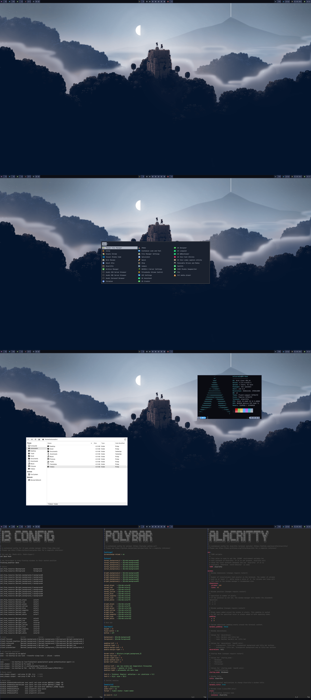

# Melvin - i3wm dot files and more
(mainly inspired by [Myrmidon](https://github.com/Barbarossa93/Myrmidon))

This repository contains a dotfiles for my home/work setup. Please note that several packages are highly recommended and/or required to install. All of them will be listed further below.
Feel free to clone the repository and edit any of the files to fit your needs.

- OS: [Arch](https://archlinux.org/) Linux
- Window Manager: [i3wm](https://i3wm.org/) ([i3-gaps](https://github.com/Airblader/i3) fork)
- Display manager: [xinit](https://wiki.archlinux.org/title/Xinit)
- Bar: [polybar](https://polybar.github.io/)
- Terminal: [alacritty](https://github.com/alacritty/alacritty)
- Shell: [zsh](https://www.zsh.org/) using [oh-my-zsh](https://ohmyz.sh/) framework and [powerlevel10k](https://github.com/romkatv/powerlevel10k) theme
- App Launcher: [rofi](https://github.com/davatorium/rofi) with my custom made theme
- Fonts: [Roboto](https://fonts.google.com/specimen/Roboto) for primary text, [JetBrains Mono](https://www.jetbrains.com/lp/mono/) for terminal, [Siji](https://github.com/stark/siji) for bar icons and [Terminus](http://terminus-font.sourceforge.net/) for bar.
- GTK: [Fluent](https://www.pling.com/p/1477941/)
- Icons: [Papirus](https://www.gnome-look.org/p/1166289/)
- Editor: [vim](https://www.vim.org/)
- Color scheme: customized [OneDark](https://github.com/navarasu/onedark.nvim)
- Wallpaper: please see my [wallpapers](https://github.com/radimkolos/wallpapers) repository
# Table of contents
1. [Installation of Yay](#yayInstall)
2. [Required packages](#requiredPackages)
3. [Recommended packages](#recommendedPackages)
4. [A bit of issue-resolving and handy guides](#issues)
    1. [A clean zsh installation](#zshInstallation)
    2. [Qt5ct fix](#qt5ctFix)



### Installation of [Yay](https://github.com/Jguer/yay) (Yet Another Yogurt) - An AUR Helper Written in Go <a name="yayInstall"></a>

To install yay you have to have install [git](https://archlinux.org/packages/extra/x86_64/git/) first.

```sh
git clone https://aur.archlinux.org/yay.git # Clone the repository
cd yay                                      # Move to the directory
makepkg -si                                 # Build and install
yay -S gparted                              # Update yay repos
```

## Required packages <a name="requiredPackages"></a>

Here is the list of the absolutely needed packages to install on your system.

| Package | Description | Availability |
| -                       | - | - |
| alacritty               | A fast, cross-platform, OpenGL terminal emulator                                    | Arch repos |
| alsa-utils              | Advanced Linux Sound Architecture - Utilities                                       | Arch repos |
| awesome-terminal-fonts  | Fonts/icons for powerlines                                                          | Arch repos |
| feh                     | Image viewer and cataloguer                                                         | Arch repos |
| git                     | A fast distributed version control system                                           | Arch repos |
| i3-gaps                 | A fork of i3wm tiling window manager with more features, including gaps             | Arch repos |
| i3lock                  | Improved screenlocker based upon XCB and PAM                                        | Arch repos |
| lxappearance            | Feature-rich GTK+ theme switcher of the LXDE Desktop                                | Arch repos |
| openssh                 | Premier connectivity tool for remote login with the SSH protocol                    | Arch repos |
| oh-my-zsh-git           | A community-driven framework for managing your zsh configuration                    | AUR |
| pavucontrol             | PulseAudio Volume Control                                                           | Arch repos |
| playerctl               | Mpris media player controller                                                       | Arch repos |
| polkit-gnome            | Legacy polkit authentication agent for GNOME                                        | Arch repos |
| polybar                 | A fast and easy-to-use status bar                                                   | AUR |
| pulseaudio              | A featureful, general-purpose sound server                                          | Arch repos |
| qt5ct                   | Qt5 Configuration Utility                                                           | Arch repos |
| qt5-styleplugins        | Additional style plugins for Qt5                                                    | AUR |
| rofi                    | A window switcher, application launcher and dmenu replacement                       | Arch repos |
| siji-git                | Iconic bitmap font based on stlarch with additional glyphs                          | AUR |
| terminus-font           | Monospace bitmap font (for X11 and console)                                         | Arch repos |
| vim                     | Vi Improved, a highly configurable, improved version of the vi text editor          | Arch repos |
| xorg-xfd                | Displays all the characters in a font using either the X11 core protocol or libXft2 | Arch repos |
| xorg-xinit              | X.Org initialisation program                                                        | Arch repos |
| xorg-xinput             | Small commandline tool to configure devices                                         | Arch repos |
| yay                     | Yet another yogurt. Pacman wrapper and AUR helper written in go.                    | AUR |
| zsh-syntax-highlighting | Fish shell like syntax highlighting for Zsh                                         | Arch repos |
| zsh-theme-powerlevel10k | Powerlevel10k is a theme for Zsh                                                    | Arch repos |

You can copy/paste these commands to your terminal to install all of the required packages all at once. (yay has to be install first.)

```sh
sudo pacman -Syu && yay -Syu    #Update your system

sudo pacman -S alacritty alsa-utils awesome-terminal-fonts feh git i3-gaps i3lock openssh \
pavucontrol playerctl polkit-gnome pulseaudio qt5ct rofi terminus-font vim xorg-xfd \
xorg-xinit xorg-xinput zsh-syntax-highlighting zsh-theme-powerlevel10k #Install the Arch packages


yay -S oh-my-zsh-git polybar qt5-styleplugins siji-git  #Install the AUR packages
```

## Recommended packages <a name="recommendedPackages"></a>

Here is the list of the recommended packages to install on your system.

| Package | Description | Availability |
| -                        | - | - |
| chromium                 | Web browser from Google                                                            | Arch repos |
| file-roller              | Create and modify archives                                                         | Arch repos |
| galculator               | GTK+ based scientific calculator                                                   | Arch repos |
| gdb                      | The GNU Debugger                                                                   | Arch repos |
| google-chrome            | The popular and trusted web browser by Google                                      | AUR |
| gpick                    | Advanced color picker written in C++ using GTK+ toolkit                            | Arch repos |
| grub                     | GNU GRand Unified Bootloader                                                       | Arch repos |
| gvfs                     | Virtual filesystem implementation for GIO                                          | Arch repos |
| htop                     | Interactive process viewer                                                         | Arch repos |
| imagewriter              | A graphical utility for writing raw disk images & hybrid isos to USB keys          | AUR |
| ksnip                    | Qt-based screenshot tool that provides many annotation features                    | Arch repos |
| man-db                   | A utility for reading man pages                                                    | Arch repos |
| mupdf                    | Lightweight PDF and XPS viewer                                                     | Arch repos |
| neofetch                 | A CLI system information tool written in BASH that supports displaying images      | Arch repos |
| net-tools                | Configuration tools for Linux networking                                           | Arch repos |
| networkmanager           | Network connection manager and user applications                                   | Arch repos |
| nomacs                   | A Qt image viewer                                                                  | Arch repos |
| ntfs-3g                  | NTFS filesystem driver and utilities                                               | Arch repos |
| nvidia                   | NVIDIA drivers for linux                                                           | Arch repos |
| nvidia-settings          | Tool for configuring the NVIDIA graphics driver                                    | Arch repos |
| qtcreator                | Lightweight, cross-platform integrated development environment                     | Arch repos |
| spotify                  | A proprietary music streaming service                                              | AUR |
| thunar                   | Modern file manager for Xfce                                                       | Arch repos |
| thunar-archive-plugin    | Create and extract archives in Thunar                                              | Arch repos |
| thunar-media-tags-plugin | Adds special features for media files to the Thunar File Manager                   | Arch repos |
| thunar-volman            | Automatic management of removeable devices in Thunar                               | Arch repos |
| tumbler                  | D-Bus service for applications to request thumbnails                               | Arch repos |
| udiskie                  | Removable disk automounter using udisks                                            | Arch repos |
| usbmuxd                  | USB Multiplex Daemon                                                               | Arch repos |
| visual-studio-code-bin   | Editor for building and debugging modern web and cloud applications                | AUR |
| vlc                      | Multi-platform MPEG, VCD/DVD, and DivX player                                      | Arch repos |
| xdotool                  | Command-line X11 automation tool                                                   | Arch repos |
| xorg-xrandr              | Primitive command line interface to RandR extension                                | Arch repos |
| xorg-xsetroot            | Classic X utility to set your root window background to a given pattern or color   | Arch repos |

You can copy/paste these commands to your terminal to install all of the required packages all at once. (yay has to be install first.)

```sh
sudo pacman -Syu && yay -Syu    #Update your system

sudo pacman -S chromium file-roller galculator gdb  gpick grub gvfs htop ksnip man-db \
mupdf neofetch net-tools networkmanager nomacs ntfs-3g nvidia nvidia-settings qtcreator \
thunar thunar-archive-plugin thunar-media-tags-plugin thunar-volman tumbler udiskie vlc \
xdotool xorg-xrandr xorg-xsetroot   # Install the Arch packages

yay -S google-chrome imagewriter spotify visual-studio-code-bin     #Install the AUR packages
```

## A bit of issue-resolving and handy guides <a name="issues"></a>

I am also including a several solutions to some issues I had to figure out by myself. Also something you can find handy.

### A clean installation of zsh, oh-my-zsh, and powerlevelk (with syntax highlighting) <a name="zshInstallation"></a>

First you need to install following packages by typing these commands:

```sh
yay -S oh-my-zsh-git

sudo pacman -S zsh-syntax-highlighting zsh-theme-powerlevel10k
```

Then copy the example/default oh-my-zsh implementation of zsh configuration into your home folder.

```sh
cp /usr/share/oh-my-zsh/zshrc ~.zshrc
```

To enable syntax highlighting, run the following command:

```sh
echo -e '\nsource /usr/share/zsh/plugins/zsh-syntax-highlighting/zsh-syntax-highlighting.zsh' >> ~/.zshrc
```

To enable powerlevel10k theme, run the following command:

```sh
echo -e '\nsource /usr/share/zsh-theme-powerlevel10k/powerlevel10k.zsh-theme' >> ~/.zshrc
```

Once your restart your terminal a p10k configuration should appear. In case it didn't appear just run 'p10k configure'.
It is also recommended to restart your system so /bin/zsh appears automatically instead of /bin/bash.

**Don't forget to edit the .zshrc file to fit your needs!** J

### Fixing of issue - Qt5ct QT_QPA_PLATFORMTHEME environment variable is not set <a name="qt5ctFix"></a>

To fix this issue, just run the following command. [Source](https://forum.mxlinux.org/viewtopic.php?t=43970).

```sh
sudo sed -i -e '$aQT_QPA_PLATFORMTHEME=qt5ct' /etc/environment
```